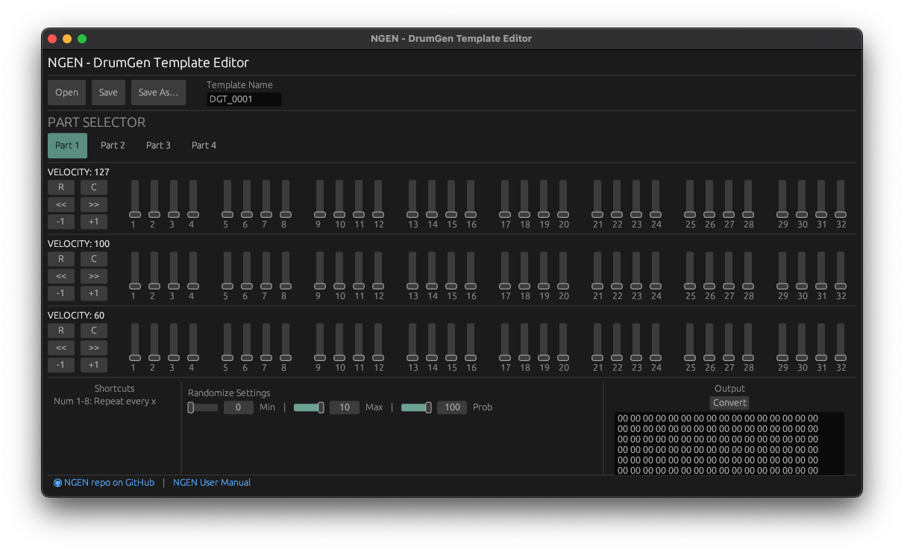

# DrumGen Template Editor for NGEN

## About

GUI-based template editor for the [DrumGen generator](https://ngen.spektroaudio.com/generators/#drumgen) available in [NGEN – Algorithmic MIDI Workstation](https://spektroaudio.com/ngen).



The editor is written in Rust and it uses the [egui](https://egui.rs) + eframe framework.

## Installation

1 - Make sure you have Rust installed. If not, you can install it by following the instructions at [rustup.rs](https://rustup.rs).  
2 - Clone this repository: ```git clone https://github.com/SpektroAudio/DrumGenTemplateEditor.git || cd DrumGenTemplateEditor```
3 - Run `cargo run --release` in the root of the repository.  

## Usage

The editor lets you create new DrumGen templates, load and edit existing ones, and save them to disk as .hex files.

Each template contains 32-step probability sequences for 4 parts with 3 velocity layers each that can be edited using the sliders.  

The editor also includes options for randomizing layers (with adjustable random settings) and shifting the sequence back and forth.

It's also possible to edit multiple steps in the same layer at once by holding down numbers 1-8 on the keyboard while dragging the sliders.

*Attention*: DrumGen HEX filenames must have at most 8 characters and the .hex extension (e.g. `drum0001.hex`).

To use your templates in NGEN, copy the .hex file created to the DRUMGEN folder (/DRUMGEN) on your NGEN SD card.

---

For more information about NGEN, visit [spektroaudio.com](https://spektroaudio.com).